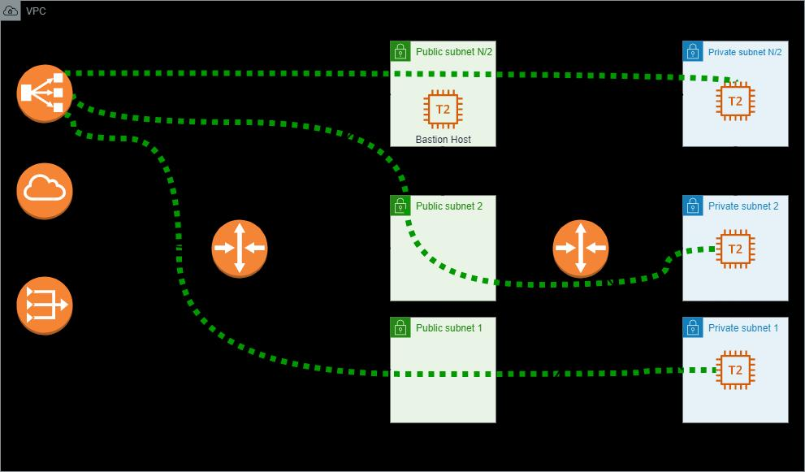

# NTTDATA Challenge

## Input variables for terraform

Create the terraform.tfvars file based on the terraform.tfvars.example

|Variable|Type|Default|Required|Description|
|--------|-----|------|--------|-----------|
|manifest_path|string||yes|The path where the manifest file is dumped by the packer build command|
|network_cidr|string||yes|CIDR for VPC|
|n_subnets|number||yes|Max number of subnets|
|name|string||yes|Name to use on the resources|
|tags|map(string)|{}|no|AWS Resources tags for all resources|
|aws_region|string|us-east-1|no|AWS Region|

<BR>

## Input variables for Hashicorp Packer

Create the variables.pkrvars.hcl file based on the variables.pkrvars.hcl.example

|Variable|Type|Default|Required|Description|
|--------|-----|------|--------|-----------|
|name|string||yes|Name to use on the resources|
|aws_region|string|us-east-1|no|AWS Region|

<BR>

## Golden Image
To create a golden image, use the Makefile command:

```sh
make golden-image
```

## Infrastructure
To deploy the infrastructure use the Makefile command

If you want to run ```terraform plan```, first is necessary initialize the terraform, however you are able to execute "apply" without "plan"

- Initialize to plan
```
make check
terraform plan
```
- Run apply
```sh
make apply
```

